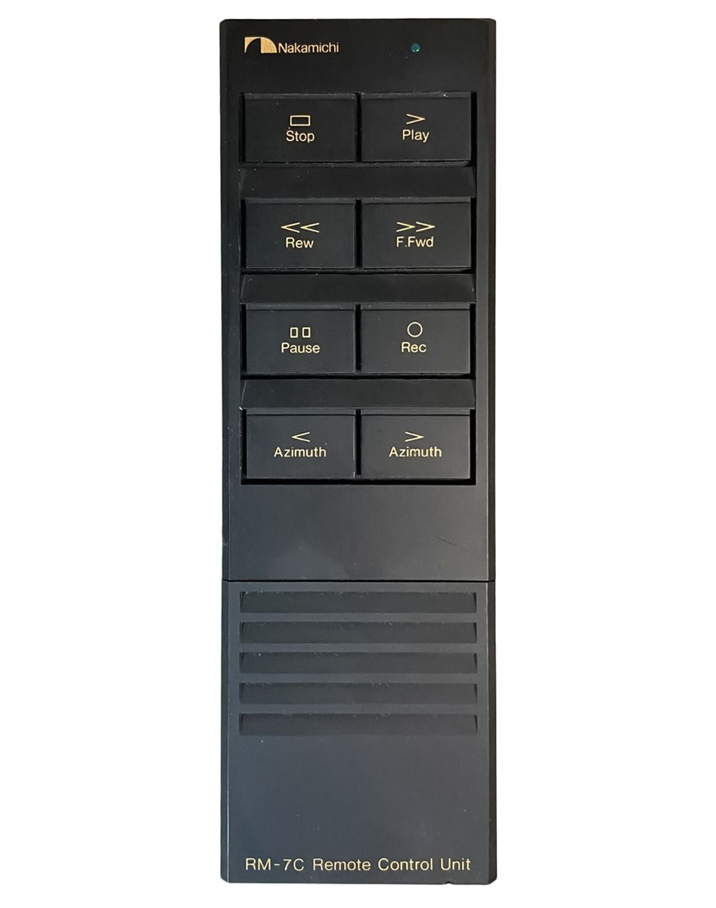
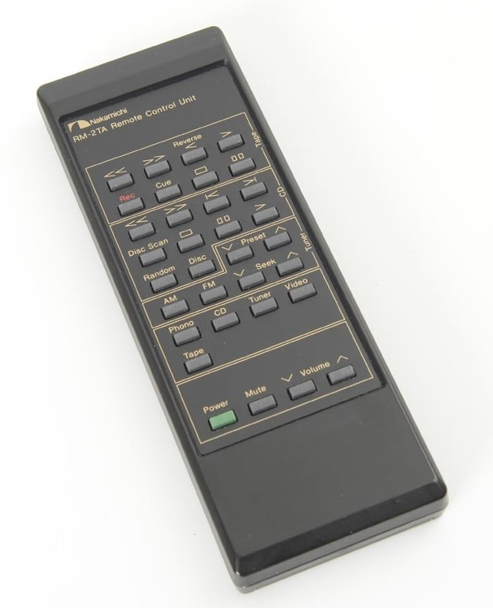

# Nakamichi IR Remotes

Infrared remote-control files and documentation for Nakamichi cassette decks,
tuners, amplifiers, and related components.

The files in this repository are in Flipper Zero's `.ir` format and can be
used directly from the Flipper Zero infrared remote application.

## Remote Photos

| RM-7C | RM-2TA |
| --- | --- |
|  |  |

## Tested Equipment

| Remote file | Tested equipment | Functions |
| --- | --- | --- |
| [`Nakamichi_RM-7C.ir`](flipper/Nakamichi_RM-7C.ir) | Nakamichi CR-7A cassette deck | Transport controls and azimuth adjustment |
| [`Nakamichi_RM-2TA.ir`](flipper/Nakamichi_RM-2TA.ir) | Nakamichi TA-2A tuner/amplifier | Power, mute, volume, inputs, tape, CD, and tuner controls |

The files are stored in [`flipper/`](flipper/). The tested-equipment entries
identify the equipment used for validation; they do not guarantee that every
individual command has been tested on that equipment.

## Flipper Zero

Copy the `.ir` files to the Flipper Zero infrared directory on the SD card:

```text
/infrared/
```

They can then be selected from the Flipper Zero infrared application and sent
to the corresponding Nakamichi equipment.

## Other Uses

The `.ir` files are also a record of the remote protocol and can be used to
recreate the commands on other infrared hardware. Possible uses include:

- Arduino or ESP32 projects with an IR LED and a compatible IR library
- Home-automation IR blasters, including custom integrations and automations
- Raspberry Pi or Linux infrared tools after converting the NEC values to the
  tool's configuration format
- Building a replacement remote or a small dedicated controller
- Comparing commands across Nakamichi equipment and documenting related remotes

For these uses, extract the NEC address and command for the desired button
from the corresponding file and configure the transmitter to send NEC. The
Flipper `.ir` syntax is not a universal IR interchange format, so most other
tools will require a conversion or a small amount of manual configuration.
Devices that learn and transmit raw IR, such as some consumer IR blasters,
may also require a fresh learning capture because these files do not include
raw pulse timings.

## Signal Details

The captures use the NEC infrared protocol in Flipper's parsed signal format.

- `Nakamichi_RM-7C.ir` contains 8 signals using NEC address `67`.
- `Nakamichi_RM-2TA.ir` contains 35 signals.
	- NEC address `5C` is used for power, amplifier, tape, and tuner functions.
	- NEC address `67` is used for CD functions.

The address and command values are preserved in each `.ir` file, making the
captures useful as a reference when implementing the remote protocol in other
hardware or software. A tool that supports NEC signals, or a converter that
accepts Flipper `.ir` files, may be able to reuse them outside the Flipper
Zero. Compatibility and button behavior should be verified against the target
equipment.

These files contain parsed NEC signals rather than raw timing captures. They
do not currently document the infrared carrier frequency or repeat timing, so
non-Flipper implementations may need to determine those values separately.

## Contributing

When adding a remote or capture, please include:

- The remote model and the Nakamichi equipment tested
- The source file in `flipper/`
- Which buttons were tested and any buttons that remain untested
- The capture device or method, when known
- Notes about equipment-specific behavior or compatibility
